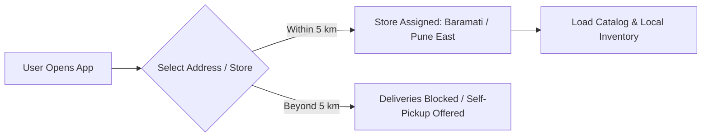
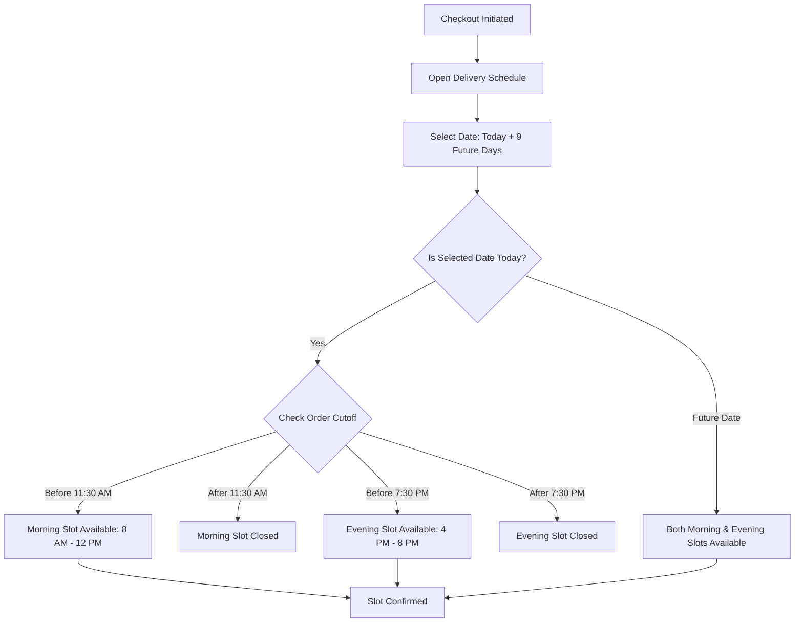
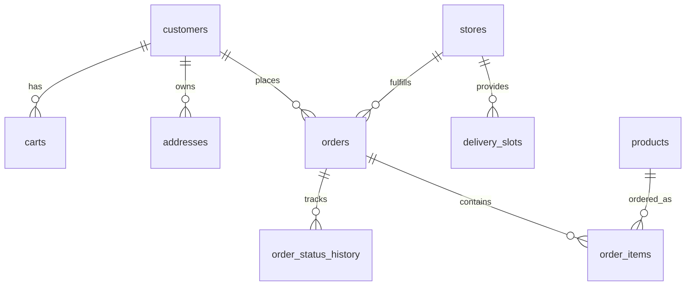

# 🛒 K MART — Modern Grocery Delivery Web Application

A full-stack, hyper-local grocery delivery platform built with **Next.js 14 App Router**, **Tailwind CSS v4**, and **Supabase (PostgreSQL & Edge Functions)**. Designed to deliver daily essentials, fresh produce, and groceries with scheduled doorstep delivery within a **5 km store radius**.

---

## 📑 Table of Contents
1. [Technology Stack](#-technology-stack)
2. [Color Palette & Design System](#-color-palette--design-system)
3. [Core Application Workflows](#-core-application-workflows)
4. [Interactive Controls & Buttons Directory](#-interactive-controls--buttons-directory)
5. [Key Features & Architecture](#-key-features--architecture)
6. [Database Schema & Supabase Configuration](#-database-schema--supabase-configuration)
7. [Project Directory Structure](#-project-directory-structure)
8. [Environment Variables](#-environment-variables)
9. [Local Development Setup](#-local-development-setup)

---

## 🛠 Technology Stack

| Layer | Technologies |
|---|---|
| **Frontend Framework** | [Next.js 14](https://nextjs.org/) (App Router, Server & Client Components) |
| **Language** | [TypeScript 5.7](https://www.typescriptlang.org/) (Strict typing across DB and UI) |
| **Styling & CSS** | [Tailwind CSS v4](https://tailwindcss.com/) + `@tailwindcss/postcss` |
| **Database & Backend** | [Supabase](https://supabase.com/) (PostgreSQL 15, Auth, Edge Functions, RLS) |
| **State Management** | React Context API (`AppContext.tsx`) with `localStorage` synchronization |
| **Icons** | [Lucide React](https://lucide.dev/) (Comprehensive SVG icon suite) |
| **Payments** | [Razorpay SDK](https://razorpay.com/) (UPI, Cards, Net Banking) + Cash on Delivery (COD) |
| **Maps & Geolocation** | [@vis.gl/react-google-maps](https://visgl.github.io/react-google-maps/) (Google Maps Platform API) |
| **Animations & Effects**| [canvas-confetti](https://www.npmjs.com/package/canvas-confetti) (Celebratory order placement effect) |
| **Typography** | `Plus Jakarta Sans` (Google Font via `next/font/google`) |

---

## 🎨 Color Palette & Design System

The application uses an energetic, high-contrast, clean retail color palette centered on **K MART Red** and **Navy Blue**:

```
Primary Red       [ #E11A22 ]  ██████  CTA buttons, active dates, highlights, cart badges
Red Hover         [ #C8141B ]  ██████  Button hover states, pressed controls
Navy Blue         [ #0A2540 ]  ██████  Primary titles, dark buttons, header accent
Navy Deep         [ #163A5F ]  ██████  Chatbot header gradient, card backgrounds
Background Gray   [ #F8F9FA ]  ██████  Page body background, soft surface
White             [ #FFFFFF ]  ██████  Card surfaces, modals, popovers
Emerald Green     [ #10B981 ]  ██████  Available slots, free delivery badges, success states
WhatsApp Green    [ #25D366 ]  ██████  WhatsApp escalation button
Amber Warning     [ #F59E0B ]  ██████  Cutoff alerts, store distance alerts
Border Gray       [ #E2E8F0 ]  ██████  Subtle card dividers and input borders
Text Dark         [ #1A202C ]  ██████  High readability body copy
Text Muted        [ #6B7280 ]  ██████  Helper labels, secondary timestamps
```

### Typography Hierarchy
* **Display & Brand**: `Plus Jakarta Sans`, Extra Bold (800) / Black (900)
* **Section Headers**: Semi-Bold (600) / Bold (700)
* **Body & Descriptions**: Regular (400) / Medium (500)

---

## 🔄 Core Application Workflows

### 1. Store Selection & Delivery Radius Workflow

* **Store 1 (Baramati)**: Kasba / Nira Road (`458cbfde-68fd-4e71-86c7-a12a4cecad4d`)
* **Store 2 (Pune East)**: Station / Camp Road (`f524383f-c351-41a3-a98d-6fb139e832a7`)
* Each store enforces a **5 km delivery radius** using Haversine distance calculations.

### 2. 10-Day Delivery Slot Scheduling Workflow


### 3. Order Placement & Payment Flow
1. **Cart Review**: Minimum order check (₹500 threshold configurable via `delivery_settings`).
2. **First 3 Orders Promotion**: First 3 orders automatically receive **₹0 Free Delivery**.
3. **Slot Booking**: Selected slot and target delivery date are tied to the order payload.
4. **Payment Method**:
   * **Cash on Delivery (COD)**: Order placed instantly with status `CONFIRMED`.
   * **Online (Razorpay)**: Razorpay checkout modal opens; on payment capture, webhook / handler records status as `PAID`.
5. **Celebration**: Confetti effect bursts on success screen, and user is redirected to live order tracking.

### 4. Interactive "Need Help?" Chatbot & Escalation Flow
* Accessible via a round **Floating Action Button (FAB)** anchored at the bottom-right of the user profile page.
* Opens a **docked, compact pop-up card** (non-fullscreen).
* Features interactive question chips categorized by **My Order**, **Delivery**, **Payment & Billing**, **My Account**, and **Products**.
* **Escalation**: If the user indicates `"Still need help"`, the assistant dynamically renders an official WhatsApp support CTA pre-filled with the exact customer issue.

---

## 🔘 Interactive Controls & Buttons Directory

| Button / Control | Location | Visual Style | Trigger Action |
|---|---|---|---|
| **Add to Cart (`+` / Qty)** | `ProductCard.tsx` | Red pill (`#E11A22`) with qty counter | Adds product to cart, updates global cart badge |
| **Location Selector** | `Navbar.tsx` | Gray pill with `MapPin` icon | Opens `LocationModal` to choose delivery address / store |
| **Cart Drawer Trigger** | `Navbar.tsx` | Navy outline with badge counter | Slides open the right-side `CartDrawer` |
| **Search Bar** | `Navbar.tsx` | Full-width rounded input with auto-suggest | Filters products in real-time or routes to `/search` |
| **Category Pill** | `CategoryPills.tsx` | Rounded outline pill with SVG icon | Filters product grid by category |
| **Schedule Date Pill** | `ScheduleOrderModal.tsx` & Checkout | Vertical day/date box (Red when active) | Selects specific day in rolling 10-day window |
| **Slot Selector** | `ScheduleOrderModal.tsx` & Checkout | Bordered card with `Clock` icon | Selects Morning (8 AM - 12 PM) or Evening (4 PM - 8 PM) |
| **Open Calendar View** | `checkout/page.tsx` | Soft red link with `Calendar` icon | Opens `ScheduleOrderModal` popup |
| **Proceed to Details / Payment** | `CheckoutModal.tsx` | Full-width solid red (`#E11A22`) | Advances multi-step checkout stepper |
| **Confirm & Place Order** | Checkout & `CheckoutModal.tsx` | Heavy red button with price summary | Calls checkout edge function / places order |
| **Need Help? FAB** | `app/profile/page.tsx` (Bottom-right) | Round Navy circle (`#0A2540`) with pulsing dot | Toggles the compact support chatbot popup |
| **Was this helpful? (👍 / 👎)** | `HelpChatBox` | Green / Gray split buttons | Marks issue resolved or triggers WhatsApp escalation |
| **Chat on WhatsApp** | `HelpChatBox` | Emerald green (`#25D366`) with WhatsApp SVG | Opens WhatsApp Web / App with pre-filled inquiry |
| **Reorder All** | `app/profile/page.tsx` | Gray button with `RotateCcw` icon | Re-adds all previous order items into active cart |
| **Track Order** | Order history & success modals | Light gray button with `ChevronRight` | Navigates to `/orders/[id]` live tracking |

---

## 📦 Key Features & Architecture

### 1. Delivery Slot Engine (`services/delivery.ts`)
* **Strict 2 Slots/Day**: Standardizes all store operations into two daily windows: Morning (`08:00 - 12:00`) and Evening (`16:00 - 20:00`).
* **Cutoff Time Protection**: Prevents customers from ordering Morning slots after 11:30 AM and Evening slots after 7:30 PM on the same day.
* **10-Day Rolling Availability**: Dynamically builds date-scoped options (`slot-morning-${date}`) ensuring future bookings never conflict with past database dates.

### 2. Intelligent Checkout Fallback (`app/checkout/page.tsx`)
* Seamlessly validates slot selection.
* If a remote database constraint reports a slot date mismatch, the frontend automatically retries the checkout transaction cleanly with `deliverySlotId: null` while preserving the chosen `scheduledDeliveryDate`.

### 3. Location Modal & Radius Enforcement (`components/LocationModal.tsx`)
* Integrates Google Maps Autocomplete and Geolocation.
* Computes exact distance to nearest K MART store. Alerts users located outside the 5 km service perimeter.

---

## 🗄 Database Schema & Supabase Configuration

The application uses PostgreSQL managed on Supabase. Below are the primary tables:



### Essential Database Tables:
* **`stores`**: Store branches (Baramati, Pune East) with geolocation and `service_radius_km`.
* **`delivery_slots`**: Daily delivery slots with `slot_name`, `slot_date`, `start_time`, `end_time`, `order_cutoff_time`, and `capacity`.
* **`customers`**: Customer profiles identified by verified phone number.
* **`addresses`**: User delivery addresses with coordinates and labels (Home, Work, Other).
* **`orders`**: Orders with order numbers (`KM-XXXXXX`), customer snapshot, slot reference, total, and status.
* **`order_items`**: Line items per order with snapshot price, quantity, and line totals.
* **`delivery_settings`**: Global configuration for delivery fees, free delivery order count, and minimum order values.

### SQL Maintenance Scripts:
The repository includes pre-configured SQL scripts ready for the Supabase SQL Editor:
* [`supabase_configure_stores_and_slots.sql`](./supabase_configure_stores_and_slots.sql): Configures stores, resets and generates the 10-day rolling delivery slots, and establishes RLS policies.
* [`supabase_setup_orders_rls.sql`](./supabase_setup_orders_rls.sql): Sets up permissive Row-Level Security for orders, customers, carts, and order items.

---

## 📁 Project Directory Structure

```
k mart ui/
├── app/                              # Next.js 14 App Router
│   ├── api/                          # Server API routes (/api/orders)
│   ├── categories/                   # Category browsing page
│   ├── checkout/                     # Dedicated full-page checkout flow
│   ├── location/                     # Location & store selection page
│   ├── offers/                       # Promotional offers & banners page
│   ├── orders/                       # Order history and /orders/[id] tracking
│   ├── product/[id]/                 # Single product detail page
│   ├── profile/                      # Profile management, saved addresses & Help Bot
│   ├── search/                       # Real-time search results page
│   ├── globals.css                   # Tailwind CSS v4 root stylesheet
│   └── layout.tsx                    # Root layout with AppProvider and global modals
├── components/                       # Reusable React components
│   ├── CartDrawer.tsx                # Sliding cart drawer with bill details
│   ├── CheckoutModal.tsx             # Pop-up stepper checkout modal
│   ├── LocationModal.tsx             # Store & delivery address chooser
│   ├── Navbar.tsx                    # Header with search, location, and mobile nav
│   ├── ProductCard.tsx               # Product card with quantity controls
│   ├── ScheduleOrderModal.tsx        # 10-Day calendar and slot picker modal
│   └── ...                           # Other modals and UI blocks
├── context/
│   └── AppContext.tsx                # Master React Context for global state
├── lib/
│   └── supabase/                     # Supabase client, server, and admin factories
├── services/                         # Business logic services
│   ├── addresses.ts                  # Address CRUD
│   ├── cart.ts                       # Cart synchronization
│   ├── delivery.ts                   # 10-day scheduling & cutoff calculation
│   ├── orders.ts                     # Order placement & status queries
│   └── products.ts                   # Product & category fetchers
├── types/                            # TypeScript interfaces
│   ├── database.ts                   # Database model interfaces
│   └── index.ts                      # Frontend application models
├── postcss.config.mjs                # PostCSS config for Tailwind v4
├── tailwind.config.ts                # Tailwind content configuration
└── package.json                      # Project dependencies & scripts
```

---

## 🔑 Environment Variables

Create a `.env.local` file in the project root:

```env
# Supabase Configuration
NEXT_PUBLIC_SUPABASE_URL=https://<your-project-ref>.supabase.co
NEXT_PUBLIC_SUPABASE_ANON_KEY=<your-supabase-anon-key>

# Optional: Supabase Service Role Key for server-side admin API routes
# SUPABASE_SERVICE_ROLE_KEY=<your-service-role-key>

# Razorpay Payment Gateway (Public Key)
NEXT_PUBLIC_RAZORPAY_KEY_ID=rzp_test_XXXXXXXXXXXXXXXXXX

# Google Maps Platform (Maps Javascript API & Places Autocomplete)
NEXT_PUBLIC_GOOGLE_MAPS_API_KEY=AIzaSyXXXXXXXXXXXXXXXXXXXXXXXXXXXXX
```

---

## 🚀 Local Development Setup

### 1. Clone & Install Dependencies
```bash
git clone <repository-url>
cd "k mart ui"
npm install
```

### 2. Configure Database
1. Open your project on the [Supabase Dashboard](https://supabase.com/dashboard).
2. Go to the **SQL Editor**.
3. Run [`supabase_configure_stores_and_slots.sql`](./supabase_configure_stores_and_slots.sql) to set up stores and 10-day delivery slots.
4. Run [`supabase_setup_orders_rls.sql`](./supabase_setup_orders_rls.sql) to configure table access policies.

### 3. Start Development Server
```bash
npm run dev
```
Open **[http://localhost:3000](http://localhost:3000)** (or `http://localhost:3001` if port 3000 is occupied).

### 4. Build for Production
```bash
npm run build
npm run start
```
